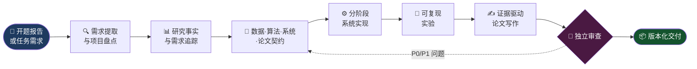

<div align="center">


[](.)
[](.)
[](.)
[](.)

<br/>

> **将开题报告或科研需求，经由多 Agent 协作，转化为**  
> 可追溯的研究方案 · 可运行的软件系统 · 可复现的实验 · 有证据支撑的硕士论文

<br/>

[功能概览](#-功能概览) · [工作流程](#-工作流程) · [Agent 团队](#-agent-团队) · [快速开始](#-快速开始) · [使用示例](#-使用示例)

</div>

---

## ✨ 功能概览

本 Skill 通过**一个协调 Agent 管理项目状态**，并调度多个专业 Agent 协同工作，将通常相互割裂的五个环节无缝连接：

<br/>

<table>
<tr>
<td align="center" width="20%"><b>📋 研究需求</b></td>
<td>研究问题、研究假设、范围、约束和可验证的验收标准</td>
</tr>
<tr>
<td align="center"><b>🧠 数据与算法</b></td>
<td>数据契约、特征来源、模型接口、评价方案和版本化制品</td>
</tr>
<tr>
<td align="center"><b>🖥️ 软件系统</b></td>
<td>系统架构、API、用户角色、业务流程、持久化、任务和测试</td>
</tr>
<tr>
<td align="center"><b>🔬 实验验证</b></td>
<td>公平基线、消融实验、原始结果、表格、图片和误差分析</td>
</tr>
<tr>
<td align="center"><b>📄 硕士论文</b></td>
<td>论证结构、证据表、章节契约、引用、结果、讨论和局限性</td>
</tr>
</table>

<br/>

```
需求形成契约  ──▶  契约驱动实现和实验  ──▶  实验产生证据  ──▶  证据支撑论文结论
```

### 核心能力

- 🔍 **需求提取**：从开题报告中识别研究目标、系统需求、创新点、数据、约束和交付物
- 🧭 **智能模式选择**：根据项目状态自动选择 bootstrap / continue / system-only / paper-only 等模式
- 🔗 **双向追踪**：为需求、代码、测试、实验和论文章节建立全链路双向追踪关系
- 🤖 **多 Agent 调度**：协调数据、算法、架构、前端、后端、实验、写作和审查 Agent
- 🚧 **质量门禁**：阻止数据泄漏、无效实验和无证据结论进入下一阶段
- 📦 **版本管理**：保留数据、代码、模型、实验、图表和论文数字的完整版本关系
- ❓ **诚实标记**：信息不完整时记录假设和待确认项，不编造字段、指标或结果

---

## 🔄 工作流程



### 七个交付阶段

| # | 阶段 | 核心动作 |
|:---:|---|---|
| **1** | 🔍 需求与项目盘点 | 读取开题报告，检查已有代码、数据、实验和论文材料 |
| **2** | 📊 研究事实与需求追踪 | 区分事实、假设、未知项、文献证据和禁止主张 |
| **3** | 📐 架构与契约设计 | 定义数据、特征、模型、API、实验和论文输入输出 |
| **4** | ⚙️ 纵向功能实现 | 按数据、基线、改进方法、系统接口和用户流程逐步交付 |
| **5** | 🧪 实验验证 | 使用固定版本、公平基线、相同预算和可复现配置运行实验 |
| **6** | ✍️ 论文材料生成 | 先写方法和实验协议，再根据真实结果写结果、讨论和结论 |
| **7** | 🔎 独立审查与交付 | 检查数据泄漏、代码论文一致性、权限、安全和证据完整性 |

### 基本原则

> 🥇 证据先于正文 &nbsp;·&nbsp; 🏗️ 契约先于实现 &nbsp;·&nbsp; 📏 数据划分先于调参  
> 📈 基线实验先于"方法更优"的结论 &nbsp;·&nbsp; 🔎 独立审查先于最终交付

---

## 📥 安装使用

### 什么是这个项目？

本项目是一个**多 Agent 协作 Skill**，可被各类 AI Agent 系统调用，用于将研究需求转化为完整的系统和论文交付物。

### 安装方法

#### 方法一：Git 克隆（推荐）

```bash
# 克隆到本地任意目录
git clone https://github.com/FeynmanNddbb/research-to-system-paper.git
cd research-to-system-paper
```

#### 方法二：手动下载

1. 访问 [GitHub 仓库](https://github.com/FeynmanNddbb/research-to-system-paper)
2. 点击 `Code` → `Download ZIP` 下载压缩包
3. 解压到本地工作目录

### 使用方式

本 Skill 适配支持 Skill 机制的 AI Agent 平台，使用时需要：

1. **将项目目录作为 Skill 引用路径** 
   - 根据你的 Agent 平台配置 Skill 加载目录
   - 确保平台能够读取 `SKILL.md` 和 `agents/` 目录

2. **在对话中调用 Skill**  
   使用平台特定的 Skill 调用语法，例如：
   ```text
   使用 $multi-agent-research-to-system-paper，
   根据这份开题报告完成需求分析、系统开发、实验验证和硕士论文材料。
   ```

3. **提供项目上下文**  
   - 将开题报告、代码仓库或项目材料放在工作目录
   - 或直接在对话中粘贴需求文档内容

### 平台适配说明

本 Skill 遵循标准的 Agent Skill 规范，理论上可被以下类型平台使用：

- ✅ 支持 SKILL.md 格式的 Agent 框架
- ✅ 支持多 Agent 编排的协作系统
- ✅ 支持工具调用和文件系统访问的 AI 助手

具体接入方式请参考你所使用平台的 Skill 集成文档。

---

## 🚀 快速开始

### 第一步：选择运行模式

| 模式 | 适用情况 | 首要动作 |
|:---:|---|---|
| `bootstrap` | 只有开题报告、任务书或初步想法 | 提取范围、事实、未知项并建立基础产物 |
| `continue` | 已有部分代码、实验或论文 | 审计现状，从下一个未通过的门禁继续 |
| `system-only` | 当前只需要完成研究软件系统 | 冻结算法和系统接口，实施并测试核心流程 |
| `paper-only` | 已有可靠实验和来源材料 | 建立论证与证据映射，只撰写有支撑的章节 |
| `integrated` | 需要从需求一路完成系统和论文 | 执行完整的依赖感知工作流 |
| `audit` | 需要审查现有项目质量 | 检查追踪性、复现性、科学有效性和系统安全 |

### 第二步：在agent中调用

**完整流程（开题报告 → 系统 + 论文）：**

```text
使用 $multi-agent-research-to-system-paper，
根据这份开题报告完成需求分析、系统开发、实验验证和硕士论文材料。
```

**接管已有仓库：**

```text
使用 $multi-agent-research-to-system-paper 检查当前仓库。
盘点已有代码、数据、实验和论文草稿，从下一个未完成的质量门禁继续推进。
```

**只完成系统部分：**

```text
使用 $multi-agent-research-to-system-paper 的 system-only 模式，
根据开题报告完成系统架构、算法接口、前后端实现和测试，不撰写论文正文。
```

### 第三步：提供项目材料

尽可能提供以下内容（缺失项会标记为假设或待确认，不会被虚构）：

- 📑 开题报告、任务书、项目需求或研究笔记
- 🗄️ 数据集、字段说明、数据字典和样例记录
- 💻 已有代码、Notebook、模型和配置文件
- 📚 文献、标准、引用和学校论文格式要求
- 🎨 页面草图、用户角色、部署环境和业务约束

---

## 🤖 Agent 团队

协调 Agent 负责维护共享状态、拆解任务并合并交付物；专业 Agent 只处理边界清晰的子任务。

```
┌─────────────────────────────────────────────────────────────┐
│                   🧭 Coordinator / Planner                  │
│              管理范围 · 依赖 · 阶段 · 项目状态               │
└──────────┬──────────────────────────────────┬───────────────┘
           │                                  │
    ┌──────▼──────┐                    ┌──────▼──────┐
    │  📋 需求侧   │                    │  📦 交付侧   │
    └──────┬──────┘                    └──────┬──────┘
           │                                  │
   ┌───────┴───────┐              ┌───────────┼───────────┐
   ▼               ▼              ▼           ▼           ▼
Requirements   Domain         Experiment  Academic    Reviewer
 Analyst      Researcher       Agent       Writer      Agent
```

<br/>

| Agent | 主要职责 | 典型交付物 |
|---|---|---|
| 🧭 **Coordinator / Planner** | 管理范围、依赖、阶段和项目状态 | 计划、决策、状态和下一步 |
| 📋 **Requirements Analyst** | 将开题内容转换为可验证需求 | 需求编号、验收规则和追踪矩阵 |
| 📚 **Domain Researcher** | 提供领域与文献证据 | 文献矩阵、证据表和研究差距 |
| 🗄️ **Data Agent** | 判断数据能否可靠回答研究问题 | 数据契约、审计和特征流水线 |
| 🧠 **Algorithm Agent** | 实现基线、改进方法和评价逻辑 | 算法代码、配置、指标和测试 |
| 🏗️ **Architecture Agent** | 设计可维护的系统模块边界 | 架构、数据流、API 和部署契约 |
| ⚙️ **Backend Agent** | 安全暴露系统与算法能力 | 服务、接口、权限、任务和测试 |
| 🎨 **Frontend Agent** | 实现完整用户工作流 | 页面、状态、权限和界面测试 |
| 🧪 **Experiment Agent** | 产生可以验证研究主张的证据 | 实验登记、结果、表格、图片和日志 |
| ✍️ **Academic Writer** | 将证据组织为论文论证 | 提纲、章节、引用和主张映射 |
| 🔎 **Reviewer Agent** | 独立检查科学性和系统质量 | 问题清单、风险和门禁结论 |

> 每次 Agent 交接必须说明：`Status | Artifacts | Decisions | Evidence | Risks | Next`  
> 共享契约只能由协调 Agent 统一修改；写入范围重叠的 Agent 不并发执行。

---

## 📦 项目产物

Skill 会优先适配已有仓库结构。新项目建议采用以下基础结构：

```
project/
├── 📄 00_scope.md                    # 项目范围与研究问题
├── 📊 01_research_canon.md           # 研究事实、假设与禁止主张
├── 🔗 02_requirements_traceability.md # 需求追踪矩阵
├── 🧾 03_evidence_table.md           # 证据表
├── 🗺️  04_argument_map.md            # 论证图
├── 📐 05_contracts.md                # 各层契约
├── 📋 state.md                       # 当前阶段、门禁状态、下一步
│
├── docs/
│   ├── architecture.md
│   ├── api.md
│   ├── data-dictionary.md
│   └── test-plan.md
│
├── algorithm/                        # 或 domain-module/
├── backend/                          # 和 frontend/，或 system-module/
│
├── experiments/
│   └── registry/                     # 每次实验的登记与结果
│
└── paper/
    ├── outline.md
    ├── citation-map.md
    ├── figure-index.md
    └── drafts/
```

### 需求追踪链

```
REQ-001
  ├── 📐 设计或系统模块
  ├── 💻 代码路径
  ├── ✅ 测试编号
  ├── 🧪 实验编号
  └── 📄 论文章节
```

> 论文中的**每个数字**都应指向实验、表格、图片、日志或可靠来源；  
> 系统中的**每项能力**都应指向实现路径和测试证据。

---

## 🚧 质量门禁

每个阶段都有对应的门禁问题，**不达标则不进入下一阶段**：

| 门禁 | 必须回答的问题 |
|:---:|---|
| 📥 **输入完整性** | 是否真正读取了开题报告并盘点了工作区？ |
| 🎯 **范围与事实** | 目标、用户、约束、假设和非目标是否明确？ |
| 🗄️ **数据有效性** | 数据来源、单位、划分、特征来源和泄漏控制是否可靠？ |
| 🧠 **算法有效性** | 接口、基线、测试、配置和指标是否可复现？ |
| 🖥️ **系统完整性** | 用户流程、权限、异常、长任务和版本是否协同工作？ |
| 🧪 **实验证据** | 公平且版本化的实验是否支持或否定研究主张？ |
| 📄 **论文证据** | 方法是否与代码一致，结论是否超出证据？ |
| 📦 **交付就绪** | 其他人能否重新运行、检查并理解交付结果？ |

### 问题等级

| 等级 | 类型 | 处理方式 |
|:---:|---|---|
| 🔴 **P0** | 数据丢失、凭据泄漏、危险外部操作、伪造证据 | **立即停止** |
| 🟠 **P1** | 数据泄漏、无效评价、错误约束、越权、无证据结论 | 修复后才能继续 |
| 🟡 **P2** | 复现、接口、边界情况或维护性风险 | 最终交付前解决 |
| 🟢 **P3** | 措辞、命名或低影响清理 | 不阻塞主要研究路径 |

---

## 💡 使用示例

### 🏭 工业预测与优化系统

```text
根据开题报告，把原料属性、质量预测、成本优化和管理后台拆分给多个 Agent，
完成数据契约、模型训练、多目标优化、系统实现、对比实验和硕士论文。
```

Skill 会从报告中识别目标与约束，将未知字段配置化，建立防泄漏建模和公平算法对比，
再把真实实验结果映射到论文主张。

---

### 🏥 医疗预测系统

```text
根据开题报告构建住院再入院预测系统和论文，已有部分训练代码但没有实验记录。
```

Skill 会选择 `continue` 模式，先审计已有代码，检查患者级与时间泄漏、隐私审批和
系统用途边界，再建立基线和论文证据。

---

### 👁️ 计算机视觉巡检平台

```text
从道路裂缝检测开题报告生成检测模型、巡检看板、消融实验和论文材料。
```

Skill 会冻结图像、标注和评价契约，在相同条件下比较基线与改进方法，
通过测试接口接入推理系统，并将图表与实验编号关联。

---

## 📁 Skill 目录

| 文件 | 作用 |
|---|---|
| [`SKILL.md`](SKILL.md) | AWS Code 运行时读取的核心工作流 |
| [`agents/openai.yaml`](agents/openai.yaml) | Skill 列表中的显示信息和默认调用提示词 |
| [`references/agent-contracts.md`](references/agent-contracts.md) | Agent 职责边界、委派格式和交接规则 |
| [`references/artifact-contracts.md`](references/artifact-contracts.md) | 基础文件、追踪字段和版本规范 |
| [`references/quality-gates.md`](references/quality-gates.md) | 阶段门禁、问题等级和最终审查问题 |

---

## ⚠️ 使用边界

该 Skill 负责协调研究与项目执行，但**不能替代**：

- 领域专家判断与伦理审批
- 实验室实测验证
- 软件安全专项审查
- 学校论文格式与合规要求

当某项决策会改变**研究问题、数据治理、核心架构或论文主张**时，Skill 会停止并请求用户确认。

---

<div align="center">


Made with ❤️ for researchers who want their code, experiments, and thesis to actually connect.

</div>
